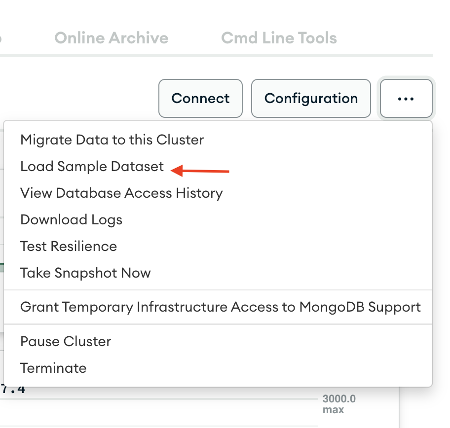
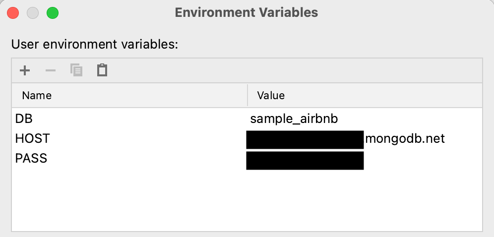

# MongoDB native Java Sync Driver and Spring Boot
This project demonstrates how to use the MongoDB Sync driver to write to an Atlas cluster and execute a search query.

# Prerequisites 
1. A MongoDB Atlas account
2. Load the sample data



3. Create a search index with the following mappings
```json
{
  "mappings": {
    "dynamic": true
  },
  "storedSource": {
    "include": [
      "host.host_verifications"
    ]
  }
}
```
4. Configure the following environment variables


# Usage
1. Launch the spring boot application
2. Insert a new record using a curl command like the following:

```shell
curl --location --request POST 'http://localhost:8080/customers' \
--header 'Content-Type: application/json' \
--data-raw '{
    "firstName": "First",
    "lastName": "Last",
    "email": "first.last@mongodb.com",
    "giftCards": [{"number": 9999999999, "expires": "2024-06-01", "balance": 50.00}]
}'
```
3. Search using the following curl command:

```shell
curl --location --request GET 'http://localhost:8080/search?term=phone'
```